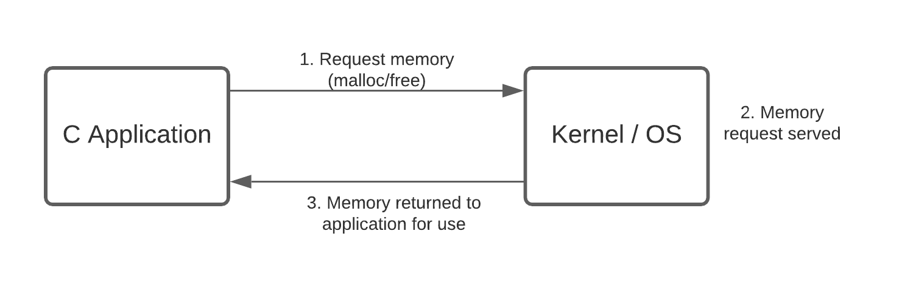
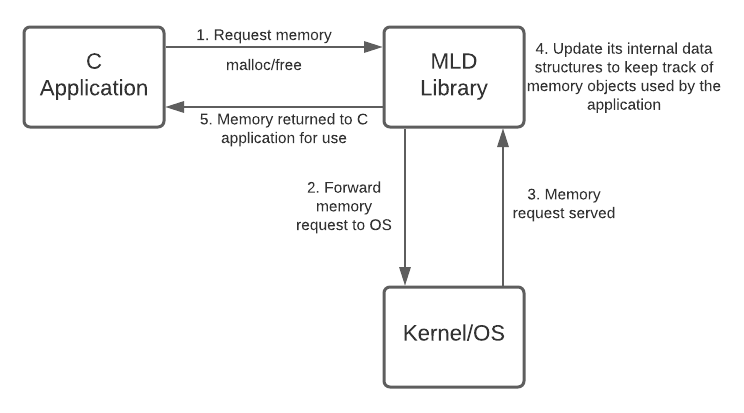
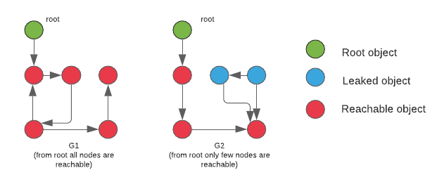

# Memory Leak Detector for C applications

This is a C library(can be extended for C++) that catches  memory leaks, if any, by the application. This library is a  generic library and has the ability to parse any application's data structures and manipulate them.

Since the advent of C/C++ Programming language, Memory management is one of the responsibilities which the developer has to deal with.

C/C++ Softwares often suffers from Two Memory related Problems :

1. Memory corruption
2. Memory leak

A detailed article on C/C++ memory related problems is given [here](http://www.yolinux.com/TUTORIALS/C++MemoryCorruptionAndMemoryLeaks.html).

Unlike Java, C/C++ does not have the luxury for automatic garbage collection. Java does not allow programmer to access the physical memory directly, but C/C++ does, nor does java expose pointers directly to the developer/coder. Therefore Java applications do not suffer from Memory corruption.

Memory Leak Detector algorithm that we have developed here works on the principle of reachability of objects to detect memory leaks. Through this project, we understand the limitation of such a garbage collector for C like programming languages (which have direct access to underlying memory addresses, unlike Java/python) and analyze its limitations and cost for being an inbuilt feature of C-like language.

## Block diagram and architecture

**Normal Scenario:** Steps for allocation/deallocation of memory when memory leak detector(MLD) library is not used.



**Using MLD library:** Steps for allocation/deallocation of memory when memory leak detector(MLD) library is used.



MLD library will keep track of all the heap objects the application has created, and how various heap objects hold reference to one another.


<!-- ## Library Components
### 1. Databases
This library uses two databases: 
**Structure database:** To maintain information about all the structures the application is using.

**Object database:** To maintain information about all the objects malloc'd by application.

These databases are nothing but linked list.

### 2. Memory Leak Detector Algorithm
MLD library triggers this algorithm on object database which in turn uses structure database to find leaked objects. It is based on depth first search algorithm.   -->


## Implementation
**1. Structure Database:** MLD library must know the information about all the structures being used by the application. This information is stored in structure database. This database is basically a linked list. Node of linked list and linked list is implemented as follows:

```C

/* structure to store information of one field of a
* C structure
*/
typedef struct _field_info_{
    char fname[MAX_FIELD_NAME_SIZE];    // field name
    data_type_t dtype;                  // data type of field. Uses data_type_t enum.
    unsigned int size;                  // size of field.
    unsigned int offset;                // displacement of the field from the beginning of the structure.
    
    /* If a field is nested structure 
     * object then its name is stored here.
     * This field is meaningful if dtype is 
     * OBJ_PTR or OBJ_STRUCT.
     */
    char nested_struct_name[MAX_STRUCT_NAME_SIZE];
}field_info_t;

/* Structure to store the information of an C structure
*  which could have n_fields
*/
typedef struct _struct_db_rec_t_ struct_db_rec_t;
struct _struct_db_rec_t_{
    struct_db_rec_t *next;    
    char struct_name[MAX_STRUCT_NAME_SIZE];     // name of structure. Will also act as key.
    unsigned int struct_size;                   // size of structure.
    unsigned int n_fields;                      // number of fields in the structure
    field_info_t *fields_arr;                   // array of n_fields elements to store info of each field 
};


/* Head of linked lists representing
* the structure database
*/

typedef struct _struct_db_{
    struct_db_rec_t *head;      // points to first record of structure record.
    unsigned int count;         // number of records in structure database.
}struct_db_t;

/* Function to add a structure record in structure database.
*  Returns 0 on success, -1 on failure.
*/
int add_structure_to_struct_db(struct_db_t *struct_db,
                               struct_db_rec_t *struct_rec);


```

**Structure Registration:** It is the responsibility of the application to tell the MLD library during initialization about all structures it is using. This is called as 'Structure Registration'.

```C
/* API's for structure registration */
/* MACRO to fill field info in field_info_t struct */
FILL_FIELD_INFO(struct_name, field_name, dtype, nested_struct_name)

/*MACRO to register structure*/
REG_STRUCT(struct_db, st_name, fields)

```
**2. Object Database:** It keeps record of all the objects that have been malloc'd. Whenever the application mallocs a new object, MLD library will store the relevant information about this object such as:  
    - Corresponding structure details of the object.  
    - Address of the object.

The object record holds the above information of the object. All such records are kept in a database called 'Object Database'. This object record and object database is modeled as follows:

```C
typedef struct _object_db_rec_ object_db_rec_t;

struct _object_db_rec_{
    object_db_rec_t *next;
    void *ptr;              // pointer to object that app has malloc'd.
    unsigned int units;     // number of units of object. It is a common 
                            // scenario where contiguous memory is allocated 
                            // multiple instances of same type of objects. 

    struct_db_rec_t *struct_rec;  // pointer to structure record in structure database.
    mld_boolean_t is_root;        // is this object root 
    mld_boolean_t is_visited;     // tracks whether current object has been 
                                  // visited when MLD algo executes.
};


typedef struct _object_db_{
    struct_db_t *struct_db;     // pointer to structure database.
    object_db_rec_t *head;      // points to first record of object database.
    unsigned int count;         // number of objects in database.
}object_db_t;


```

**3. xcalloc():**   
```C
         void* xcalloc(object_db_t *object_db, char* struct_name, int units);

```

We have also defined our own version of calloc(). We call it xcalloc(). Our application will use xcalloc() instead of calloc() or malloc() to dynamically alloate memory. It works as follows:  

1. Allocate n_units of contiguous memory for object of type "struct_name".
2. Create the object record for new allocated object, and add the object record in object database(using function add_object_to_object_db()) .
3. Link the object record with structure record for structure "struct_name".
4. Return the pointer to the allocated object.

**4. Memory Leak Detection Algorithm:**
Application data structures are organized as disjoint set of directed cyclic graphs. Objects act as node and object reference as edge. Leaked objects are those objects which are not reachable from any other objects. Thus finding the set of leaked objects is a graph problem. We can use depth first search find all such leaked nodes.

Each isolated individual graph has a special node called root of the graph. When DFS is used to traverse the graph it always starts from a root node(see diagram below)



Root objects are usually global or static objects maintained by the C appliation. Global variables can be accessed in every file and function. It may happen that our application has more than one global variables, which may result in application data structures to appear as disjoint graphs.

It is not possible to write any non-trivial application which does not have atleast one global variable. Every other malloc'd object must be reachable from atleast one root object. Malloc'd objects which are not reachable are leaked objects.

**5. Root Objects:** 
Our application must tell MLD library about all root objects it is using. For this purpose MLD library provides API using which application can register all root objects. There are two types of root objects in our application:

1.  Global Root Objects: Globally declared objects. In below given example struct emp is global root object.

```
struct emp_t{
    // some fields
};
emp_t emp;
int main(){

}

```

Global Root Object can be registered using following function:

```
void mld_register_global_object_as_root(object_db_t *object_db,     // pointer to object database
                                        void *objptr,               // pointer to root object
                                        char *struct_name,          // name of structure of root object
                                        unsigned int units);  
      

```


2. Dynamic Root Objects: These are created using xcalloc().
```
emp_t *emp = xcalloc(object_db, "emp_t", 1);
```
Here `emp` is Dynamic Root Object. xcalloc() will register this object in object database. But to mark it as root we need below given API. It will search an existing object database record entry and mark it as root.

```
void mld_set_dynamic_object_as_root(object_db_t *object_db,
                                   void *obj_ptr);          // pointer to root object
```

NOTE: 1. Global objects are referred to as global variables in application, so global objects cannot be leaked. But we still need to put these global variables in object database because these global root objects are starting point for MLD algorithm.

2. Although it is possible for Dynamic Root Objects to leak we assume they are never leaked. This is possible when they are not declared `const`.
```
    emp_t *emp = xcalloc();
    emp = NULL;
```

In above code snippet since emp was not `const` it was reassigned as NULL and is now leaked. But MLD library cannot identify it as it is declared as root, hence MLD algorithm can always reach it.


## How to use this library in C application
Step 1 : Initialize a new structure database.  

Step 2 : Create structure record for structure.  
Step 3 : Register the structure in structure database.  

**Working with object database**  
Step 1 : Initialize a new Object database.   
Step 2 : Create some sample objects, equivalent to standard.  
     
After this we can run MLD algorithm and detect leaked objects.
app.c implements these steps.  
    
